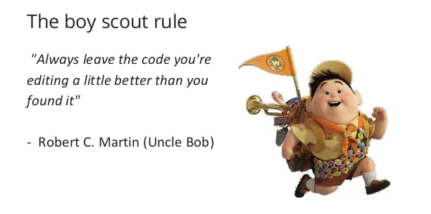

# Clean Code Notes

## Table of contents

- [Chapter 1 - Clean Code](#chapter1)
- [Chapter 2 - Meaningful Names](#chapter2)
- [Chapter 3 - Functions](#chapter3)
- [Chapter 4 - Comments](#chapter4)
- [Chapter 5 - Formatting](#chapter5)
- [Chapter 6 - Objects and Data structures](#chapter6)
- [Chapter 7 - Error Handling](#chapter7)
- [Chapter 8 - Boundaries](#chapter8)
- [Chapter 9 - Unit Tests](#chapter9)
- [Chapter 10 - Classes](#chapter10)
- [Chapter 11 - Systems](#chapter11)
- [Chapter 12 - Emergence](#chapter12)
- [Chapter 13 - Concurrency](#chapter13)
- [Chapter 14 - Successive Refinement](#chapter14)
- [Chapter 15 - JUnit Internals](#chapter15)
- [Chapter 16 - Refactoring SerialDate](#chapter16)
- [Chapter 17 - Smells and Heuristics](#chapter17)

<a name = "chapter1">
<h1>Chapter 1 - Clean Code</h1>
</a>

#### You are here for two reasons

- You are a programmer
- You want to be a better programmer

#### By end of this read,

- You'll be able to differentiate between good code and bad code
- You'll know how to write good code
- You'll know how to transform bad code into good code.

### Why write bad code?

- Trying to go fast?
- Overwhelmed by looking at the backlog?
- Deadlines?

Above could be few of the reasons for writing bad code.

<b>Never</b> think that you would revisit  your code and clean it later which is never possible, as stated below

[LeBlanc's law](http://on-agile.blogspot.com/2007/04/why-you-wont-fix-it-later.html) "Later Equals Never" 

### Why does code rot so quickly into bad code?

- Developers always complain that the requirements changed in ways that prevent from accomplishing original design
- Developers express discontent over schedules that were too tight.
- Developers always complain about managers, customers.

> It's the responsibility of developers to help work out the schedule. Developers are responsible in clearly communicating
> the way we think and project managers look to us to help work out the schedule.

It's not enough to write the code well. The code has to be kept clean over time.

About Boy Scout [Boy Scout Rule](https://biratkirat.medium.com/step-8-the-boy-scout-rule-robert-c-martin-uncle-bob-9ac839778385)


> Always leave the code you're editing a little better than you found it.
> <br> - Boy Scout

<a name="chapter2">
<h1>Chapter 2 - Meaningful Names</h1>
</a>
Names are everywhere in software. we name jar,ear,war,packages,classes,functions,variables.
Let's follow simple rules for creating good names.

### Use Intention-Revealing Names
The name of a variable,function,class should answer all the big questions.
It should answer all the big questions like
- Why it exists
- What it does
- How it is used

If a name requires a comment, then it does not reveal its intent,
rather than writing a comment of two to three words use intent revealing variable name :smile:

| Does Not Reveal Intention | Intention Revealing Name      |
|---------------------------|-------------------------------|
 | `int d;`                  | `int elapsedTimeInDays;`      |

````java
public List<int[]> getThem() {
    List<int[]> list1 = new ArrayList<int[]>();
    for (int[] x : theList) {
        if (x[0] == 4) {
            list1.add(x);
        }    
    }
    return list1;
}
````
Above code doesn't answer below questions:
1. What kind of things are stored in the `list1` ?
2. What is the significance of `zeroth` subscript in the list ?
3. what is the significance of value `4` ?

we can improve the 
````java
public List<Cell> getFlaggedCells() {
    List<Cell> flaggedCells = new ArrayList<Cell>();
    for (Cell cell : gameBoard) {
        if (cell.isFlagged()) {
            flaggedCells.add(cell);
        }    
    }
    return flaggedCells;
}
````
### Avoid Disinformation

Programmers must avoid leaving false clues that conceal the actual meaning of the code.

- Avoid using names whose established meaning vary from our intended meaning.
   - Example: hp,aix,sco would be poor variable names because they are the name of the Unix platform or variants
- Do not use xxxList as variable name to denote group of objects unless it's actually a list. If the container holding objects is not actually a list it may lead to false conclusions.
- Beware of using names which vary in smaller shapes

<a name="chapter3">
<h1>Chapter 3 - Functions</h1>
</a>
<a name="chpater4">
<h1>Chapter 4 - Comments</h1>
</a>
<a name="chapter5">
<h1>Chapter 5 - Formatting</h1>
</a>
<a name="chapter6">
<h1>Chapter 6 - Objects and Data structures</h1>
</a>
<a name="chapter7">
<h1>Chapter 7 - Error Handling</h1>
</a>
<a name="chapter8">
<h1>Chapter 8 - Boundaries</h1>
</a>
<a name="chapter9">
<h1>Chapter 9 - Unit Tests</h1>
</a>
<a name="chapter10">
<h1>Chapter 10 - Classes</h1>
</a>
<a name="chapter11">
<h1>Chapter 11 - Systems</h1>
</a>
<a name="chapter12">
<h1>Chapter 12 - Emergence</h1>
</a>
<a name="chapter13">
<h1>Chapter 13 - Concurrency</h1>
</a>
<a name="chapter14">
<h1>Chapter 14 - Successive Refinement</h1>
</a>
<a name="chapter15">
<h1>Chapter 15 - JUnit Internals</h1>
</a>
<a name="chapter16">
<h1>Chapter 16 - Refactoring SerialDate</h1>
</a>
<a name="chapter17">
<h1>Chapter 17 - Smells and Heuristics</h1>
</a>


